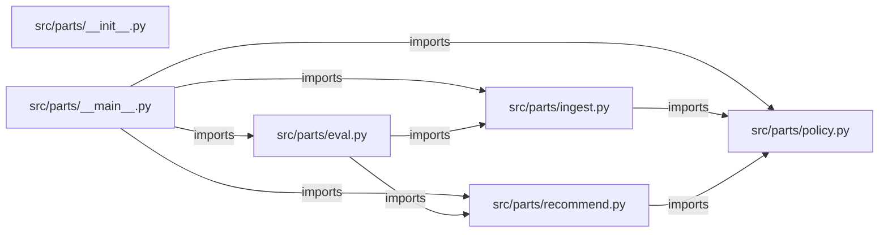

# fde-field-parts — project architecture

[README](README.md) · [Interview questions and answers](INTERVIEW_QA.md)

## Purpose and scope

Simulated forward deployed engagement for Helios Equipment. Depot techs at a site with no reliable uplink were guessing spare parts from a PDF. The depot lead will not let the tool create a purchase order, and the catalog cannot call a vendor API.

This document describes files and symbols in this checkout. Deployment templates and statements in the original overview are distinguished from a verified running environment.

## Component diagram



For Python repositories, arrows show resolved local imports, not network calls or deployment order. Otherwise the diagram is a repository component map; containment arrows do not assert runtime integration.

## Components and responsibilities

| Component | Responsibility |
| --- | --- |
| [`src/parts/recommend.py`](src/parts/recommend.py) | Functions: `recommend` |
| [`src/parts/eval.py`](src/parts/eval.py) | Functions: `run` |
| [`src/parts/policy.py`](src/parts/policy.py) | Functions: `render` |
| [`src/parts/ingest.py`](src/parts/ingest.py) | Functions: `load_assets`, `load_faults`, `load_bins`, `load_cases` |
| [`requirements.txt`](requirements.txt) | Implementation or supporting configuration |
| [`src/parts/__init__.py`](src/parts/__init__.py) | Implementation or supporting configuration |
| [`src/parts/__main__.py`](src/parts/__main__.py) | Functions: `main` |
| [`Dockerfile`](Dockerfile) | Container build/service configuration |
| [`tests/test_policy.py`](tests/test_policy.py) | Executable checks and regression examples |
| [`.github/workflows/ci.yml`](.github/workflows/ci.yml) | GitHub Actions job definitions |
| [`README.md`](README.md) | Project explanations or operating notes |
| [`docs/01-discovery.md`](docs/01-discovery.md) | Project explanations or operating notes |
| [`docs/02-security.md`](docs/02-security.md) | Project explanations or operating notes |

## Existing design and operating guides

These checked-in guides provide the project’s detailed design, operational context, or deployment view:

- [`docs/01-discovery.md`](docs/01-discovery.md).
- [`docs/02-security.md`](docs/02-security.md).

## Implementation walkthrough

### `recommend(assets: dict[str, Asset], faults: list[Fault], bins: list[Bin], asset_id: str, fault_code: str)`

Source: [`src/parts/recommend.py`](src/parts/recommend.py#L6).

Calls visible in this function: `AssetNotFound`, `Recommendation`, `max`, `next`, `tuple`.

```python
def recommend(assets: dict[str, Asset], faults: list[Fault], bins: list[Bin], asset_id: str, fault_code: str) -> Recommendation:
    try:
        asset = assets[asset_id]
    except KeyError as exc:
        raise AssetNotFound(asset_id) from exc
    match = next((fault for fault in faults if fault.fault_code == fault_code and fault.model == asset.model), None)
    if match is None:
        return Recommendation(asset_id, "escalate", None, None, None, (f"data/assets.csv#{asset_id}",))
    stocked = [bin_row for bin_row in bins if bin_row.sku == match.sku and bin_row.qty > 0]
    citations = (f"data/faults.csv#{fault_code}", f"data/assets.csv#{asset_id}")
    if not stocked:
        empty = [bin_row.bin_id for bin_row in bins if bin_row.sku == match.sku]
        cites = citations + tuple(f"data/stock.csv#{bin_id}" for bin_id in empty)
        return Recommendation(asset_id, "stockout", match.sku, None, None, cites)
    chosen = max(stocked, key=lambda bin_row: bin_row.qty)
    return Recommendation(
        asset_id,
        "recommend",
        match.sku,
        chosen.bin_id,
        match.step,
        citations + (f"data/stock.csv#{chosen.bin_id}",),
```

The excerpt is truncated; the linked source contains the full implementation.

### `run(path: Path | None=None)`

Source: [`src/parts/eval.py`](src/parts/eval.py#L9).

Calls visible in this function: `case.get`, `failures.append`, `len`, `load_assets`, `load_bins`, `load_cases`, `load_faults`, `print`, `recommend`, `result.render`, `result.render().lower`.

```python
def run(path: Path | None = None) -> int:
    assets, faults, bins = load_assets(), load_faults(), load_bins()
    failures = []
    cases = load_cases(path)
    for case in cases:
        result = recommend(assets, faults, bins, case["asset_id"], case["fault_code"])
        if result.status != case["expected_status"]:
            failures.append(f"{case['asset_id']} {case['fault_code']}: {result.status}")
        if case.get("expected_bin") and result.bin_id != case["expected_bin"]:
            failures.append(f"{case['asset_id']}: bin {result.bin_id}")
        if "purchase order" not in result.render().lower() and result.status != "escalate":
            failures.append(f"{case['asset_id']}: missing purchase-order refusal")
    if failures:
        print(f"{len(failures)} eval failure(s)")
        for failure in failures:
            print(f"- {failure}")
        return 1
    print(f"{len(cases)} eval cases passed")
    return 0
```

### `render(self)`

Source: [`src/parts/policy.py`](src/parts/policy.py#L41).

Calls visible in this function: `'\n'.join`.

```python
    def render(self) -> str:
        if self.status == "recommend":
            action = f"Pull {self.sku} from bin {self.bin_id}. {self.step} This does not create a purchase order."
        elif self.status == "stockout":
            action = f"{self.sku} has no bin with quantity above zero. Do not create a purchase order from this screen."
        else:
            action = "Fault is not on the signed list for this model. Escalate to the depot lead. Do not guess a part."
        cites = "\n".join(f"- {citation}" for citation in self.citations)
        return f"Asset {self.asset_id} status: {self.status}.\n{action}\nCitations:\n{cites}\n"
```

### `load_assets()`

Source: [`src/parts/ingest.py`](src/parts/ingest.py#L14).

Calls visible in this function: `(DATA_DIR / 'assets.csv').open`, `Asset`, `csv.DictReader`.

```python
def load_assets() -> dict[str, Asset]:
    assets = {}
    with (DATA_DIR / "assets.csv").open(newline="") as handle:
        for row in csv.DictReader(handle):
            asset = Asset(row["asset_id"], row["model"], row["site"])
            assets[asset.asset_id] = asset
    return assets
```

## Validation and failure paths

| Explicit exception | Source |
| --- | --- |
| `SystemExit(main())` | [`src/parts/__main__.py`](src/parts/__main__.py#L26) |
| `AssetNotFound(asset_id)` | [`src/parts/recommend.py`](src/parts/recommend.py#L10) |

These are explicit exceptions in the inspected source, rather than a claim that every failure is handled. Follow the calling handler to see whether the exception becomes an HTTP response or propagates.

## Data flow and design decisions

### What is the input-to-output contract of `recommend`

In [`src/parts/recommend.py`](src/parts/recommend.py#L6), `recommend(assets: dict[str, Asset], faults: list[Fault], bins: list[Bin], asset_id: str, fault_code: str)` receives the inputs. The function computes these intermediate values:

- `match = next((fault for fault in faults if fault.fault_code == fault_code and fault.model == asset.model), None)`
- `stocked = [bin_row for bin_row in bins if bin_row.sku == match.sku and bin_row.qty > 0]`
- `citations = (f'data/faults.csv#{fault_code}', f'data/assets.csv#{asset_id}')`
- `chosen = max(stocked, key=lambda bin_row: bin_row.qty)`

Its result is defined by:

- `Recommendation(asset_id, 'recommend', match.sku, chosen.bin_id, match.step, citations + (f'data/stock.csv#{chosen.bin_id}',))`
- `Recommendation(asset_id, 'escalate', None, None, None, (f'data/assets.csv#{asset_id}',))`
- `Recommendation(asset_id, 'stockout', match.sku, None, None, cites)`

### Which decision rules or boundary conditions should an interviewer challenge

The implementation in [`src/parts/recommend.py`](src/parts/recommend.py#L6) branches on:

- `match is None`
- `not stocked`

A useful extension is a table-driven test that covers each condition just below, at, and above its boundary where applicable. These expressions are the current rules; changing them changes behavior and should be justified by the project’s acceptance criteria.

## Setup and verification

The following commands are derived from the checked-in dependency/test contracts. Execute them from the repository root; the block prepares a local environment, not a cloud deployment.

```bash
python3 -m venv .venv
source .venv/bin/activate
python -m pip install -r requirements.txt
python -m pytest -q
```

Python dependencies: [`requirements.txt`](requirements.txt).

Test entry points: [`tests/test_policy.py`](tests/test_policy.py).

Automation definitions: [`.github/workflows/ci.yml`](.github/workflows/ci.yml). Read their triggers and job steps to determine what CI actually runs.

## Operating boundaries and design review

Before turning this checkout into a customer deployment, establish the input contract, data ownership, access controls, failure response, evaluation criteria, and rollback owner. Repository fixtures and unit tests demonstrate local behavior; they do not establish throughput, uptime, compliance, or business impact.

A useful architecture review starts with the linked implementation: identify where input enters, where a decision is made, which state can change, and which external dependency can fail. Add a deployment view only for infrastructure that is actually configured and exercised.
